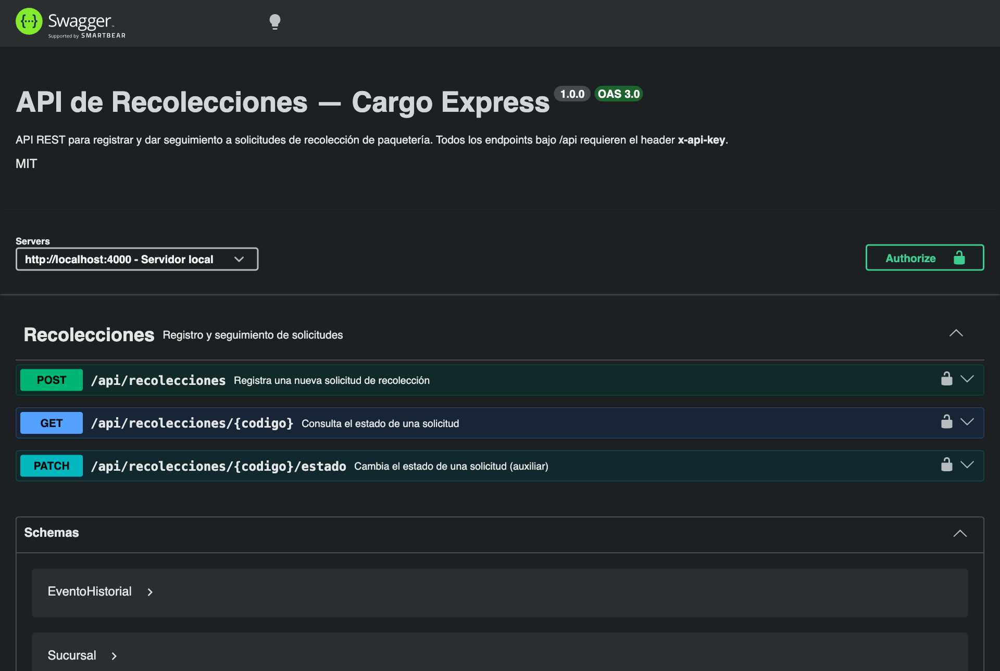
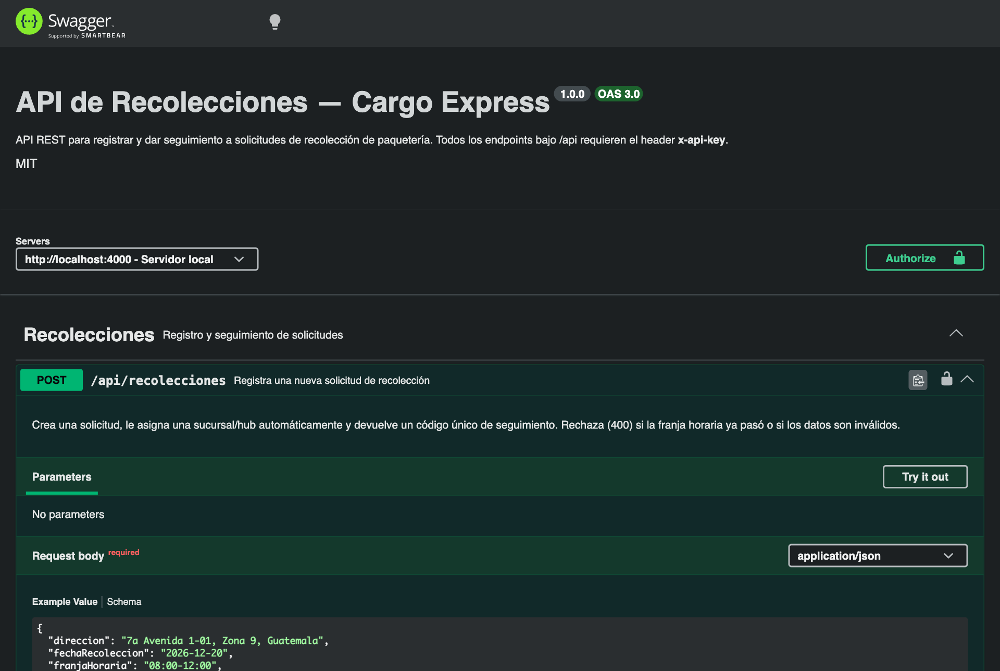

# 🛠️ Manual Técnico — Documentación Swagger / OpenAPI

Este documento explica **cómo está construida** y **cómo se usa** la
documentación interactiva de la API de Recolecciones, generada con
**Swagger / OpenAPI 3.0**.

---

## Contenido

1. [¿Qué es y dónde está?](#1-qué-es-y-dónde-está)
2. [Cómo se genera (arquitectura)](#2-cómo-se-genera-arquitectura)
3. [Acceder a la interfaz](#3-acceder-a-la-interfaz)
4. [Autenticación con API Key](#4-autenticación-con-api-key)
5. [Probar los endpoints (Try it out)](#5-probar-los-endpoints-try-it-out)
6. [Endpoints documentados](#6-endpoints-documentados)
7. [Esquemas y códigos de respuesta](#7-esquemas-y-códigos-de-respuesta)
8. [Cómo extender la documentación](#8-cómo-extender-la-documentación)

---

## 1. ¿Qué es y dónde está?

La API expone su documentación de dos formas:

| Recurso | URL | Descripción |
| ------- | --- | ----------- |
| **Swagger UI** | `http://localhost:4000/api-docs` | Interfaz web interactiva. |
| **Especificación OpenAPI** | `http://localhost:4000/api-docs.json` | JSON crudo (OpenAPI 3.0), importable en Postman/Insomnia. |



---

## 2. Cómo se genera (arquitectura)

La documentación se genera **automáticamente a partir del código**, combinando
dos librerías:

- **`swagger-jsdoc`**: lee anotaciones `@openapi` escritas como comentarios en
  los archivos de rutas y construye la especificación OpenAPI.
- **`swagger-ui-express`**: sirve la interfaz web de Swagger a partir de esa
  especificación.

Archivos clave:

| Archivo | Rol |
| ------- | --- |
| [`backend/src/docs/swagger.js`](../backend/src/docs/swagger.js) | Definición base (info, servers, `securitySchemes`, `schemas`). |
| [`backend/src/routes/recolecciones.routes.js`](../backend/src/routes/recolecciones.routes.js) | Anotaciones `@openapi` por endpoint. |
| [`backend/src/app.js`](../backend/src/app.js) | Monta `/api-docs` (UI) y `/api-docs.json` (spec). |

Flujo de montaje (en `app.js`):

```js
import swaggerUi from 'swagger-ui-express';
import swaggerSpec from './docs/swagger.js';

app.use('/api-docs', swaggerUi.serve, swaggerUi.setup(swaggerSpec));
app.get('/api-docs.json', (_req, res) => res.json(swaggerSpec));
```

---

## 3. Acceder a la interfaz

1. Levanta el backend (local o con Docker).
2. Abre **http://localhost:4000/api-docs** en el navegador.
3. Verás el título, la versión (`1.0.0`), el badge `OAS 3.0`, el selector de
   *Servers* y el botón **Authorize**.

---

## 4. Autenticación con API Key

Todos los endpoints bajo `/api` requieren el header **`x-api-key`**. En Swagger
esto se declara como un `securityScheme` de tipo `apiKey`:

```js
securitySchemes: {
  ApiKeyAuth: { type: 'apiKey', in: 'header', name: 'x-api-key' }
}
```

**Para autenticarte en la UI:**

1. Pulsa el botón **Authorize** (candado, arriba a la derecha).
2. Ingresa la API Key (por defecto `cargo-express-demo-key-2026`).
3. Pulsa **Authorize** y luego **Close**.

A partir de ese momento, Swagger enviará el header `x-api-key` en cada petición.
Si no te autenticas, las peticiones responderán **401**.

---

## 5. Probar los endpoints (Try it out)

1. Expande un endpoint (por ejemplo `POST /api/recolecciones`).
2. Pulsa **“Try it out”**.
3. Edita el *Request body* de ejemplo.
4. Pulsa **“Execute”**.
5. Swagger mostrará el `curl` equivalente, el código de respuesta y el cuerpo.



---

## 6. Endpoints documentados

| Método | Ruta | Descripción | Respuestas |
| ------ | ---- | ----------- | ---------- |
| `POST` | `/api/recolecciones` | Registra una solicitud y devuelve un código único. | `201`, `400`, `401` |
| `GET` | `/api/recolecciones/{codigo}` | Consulta estado, sucursal e historial. | `200`, `401`, `404` |
| `PATCH` | `/api/recolecciones/{codigo}/estado` | Cambia el estado (dispara notificación simulada). | `200`, `400`, `401`, `404` |

---

## 7. Esquemas y códigos de respuesta

Los **schemas** reutilizables están definidos en `swagger.js` (`components.schemas`):

- `CrearRecoleccionRequest` — cuerpo del `POST`.
- `CambiarEstadoRequest` — cuerpo del `PATCH`.
- `Recoleccion`, `Sucursal`, `Cliente`, `EventoHistorial` — modelo de respuesta.
- `ErrorResponse` — formato uniforme de error.

**Formato de error** (consistente en toda la API):

```json
{
  "success": false,
  "error": {
    "code": "NOT_FOUND",
    "message": "No encontramos ninguna solicitud con ese código.",
    "details": null
  }
}
```

| Código | Significado |
| ------ | ----------- |
| `200` / `201` | Operación exitosa. |
| `400` | Datos inválidos o franja horaria ya pasada (incluye `details` por campo). |
| `401` | Falta el header `x-api-key` o es inválido. |
| `404` | No existe una solicitud con ese código. |

---

## 8. Cómo extender la documentación

Para documentar un nuevo endpoint:

1. Añade un bloque de comentario `@openapi` sobre la ruta en el archivo de rutas:

   ```js
   /**
    * @openapi
    * /api/nuevo-endpoint:
    *   get:
    *     tags: [Recolecciones]
    *     summary: Descripción corta
    *     security: [{ ApiKeyAuth: [] }]
    *     responses:
    *       200: { description: OK }
    */
   router.get('/nuevo-endpoint', controlador);
   ```

2. Si necesitas un nuevo modelo, agrégalo en `components.schemas` dentro de
   `swagger.js` y referéncialo con `$ref: '#/components/schemas/MiModelo'`.
3. Reinicia el backend: la especificación se regenera automáticamente.

> No es necesario mantener un archivo OpenAPI a mano: la fuente de verdad es el
> código anotado, lo que evita que la documentación se desactualice.

---

_Para la guía de uso del portal web, revisa el
[Manual de Usuario](MANUAL_USUARIO.md)._
