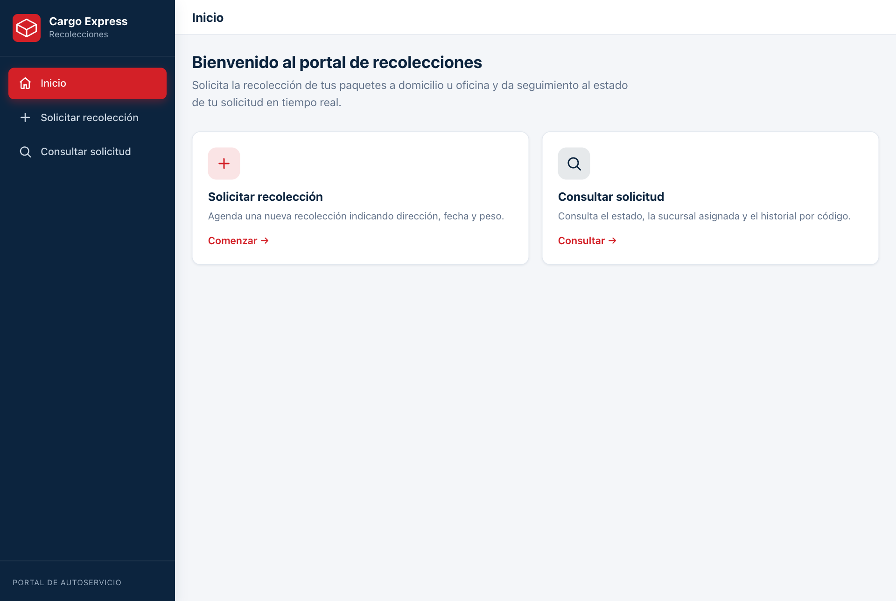
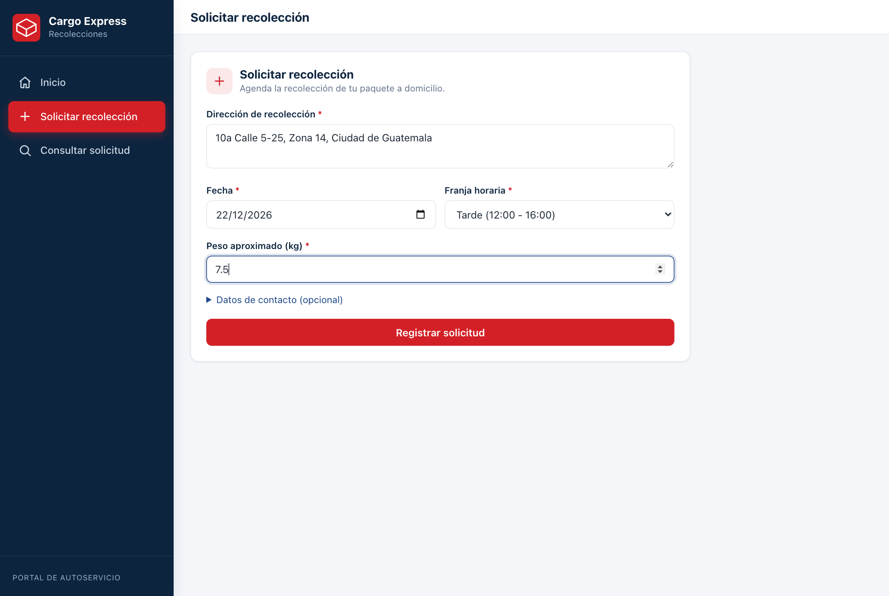
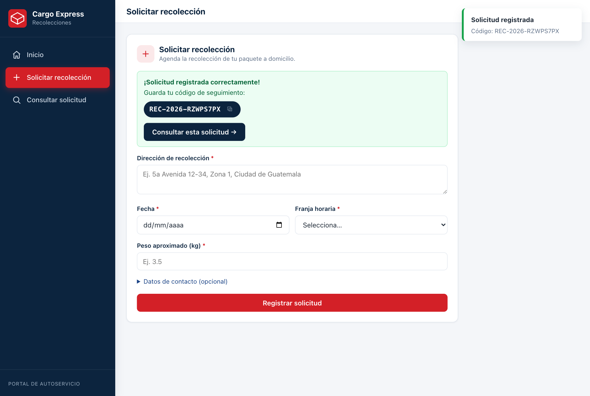
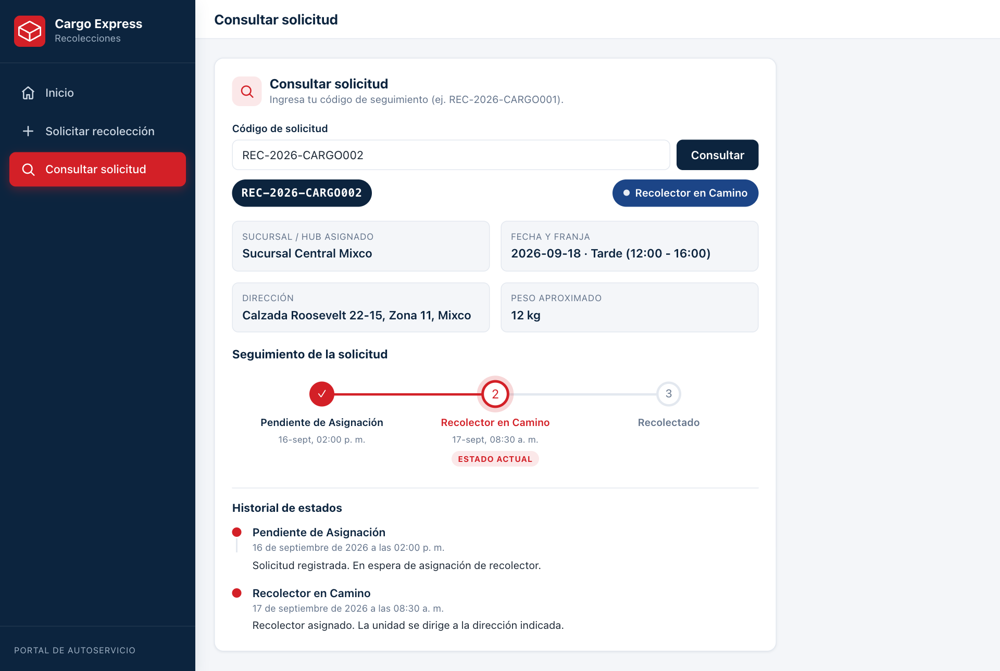
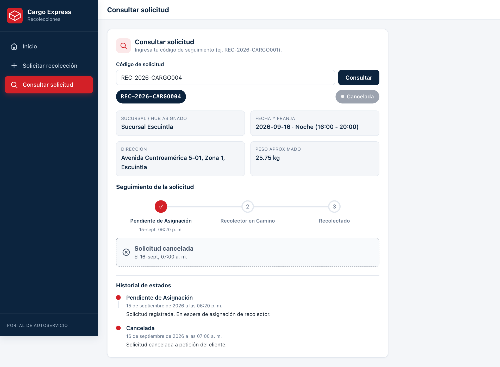
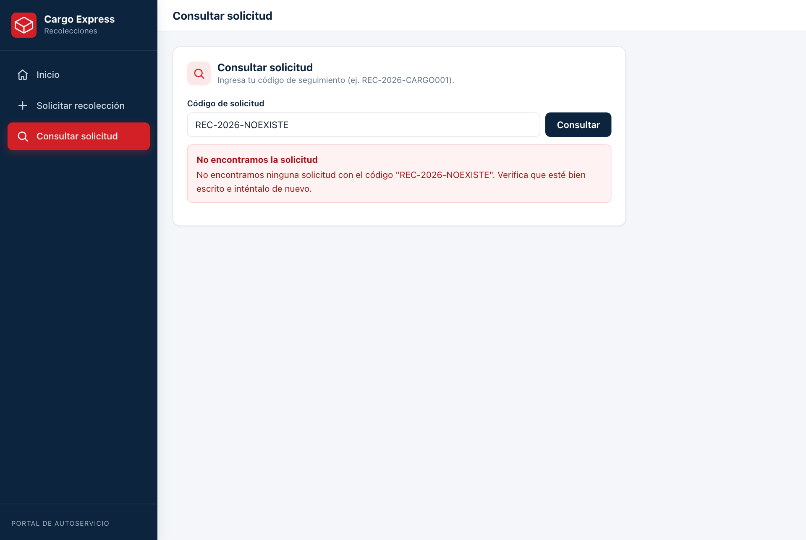
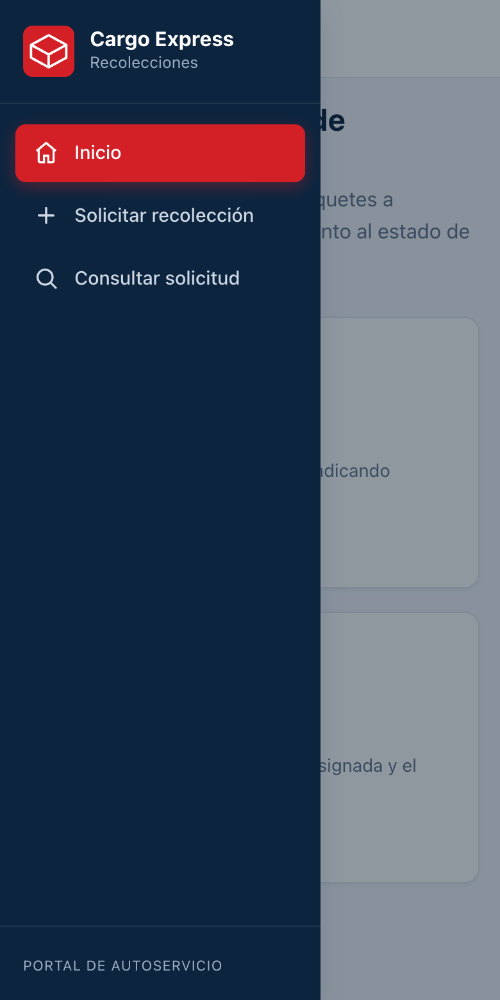

# 📘 Manual de Usuario — Portal de Recolecciones

Guía paso a paso para usar el portal de autoservicio de recolecciones de
**Cargo Express**. El portal permite **solicitar** la recolección de un paquete
a domicilio y **dar seguimiento** al estado de la solicitud mediante un código.

> URL del portal (según el despliegue):
> - Con Docker: **http://localhost:8080**
> - En desarrollo local: **http://localhost:5173**

---

## Contenido

1. [Pantalla de Inicio](#1-pantalla-de-inicio)
2. [Solicitar una recolección](#2-solicitar-una-recolección)
3. [Consultar una solicitud](#3-consultar-una-solicitud)
4. [Interpretar la línea de tiempo](#4-interpretar-la-línea-de-tiempo)
5. [Casos especiales](#5-casos-especiales)
6. [Uso en móvil](#6-uso-en-móvil)

---

## 1. Pantalla de Inicio

Al abrir el portal se muestra la pantalla de **Inicio**. A la izquierda está el
**menú lateral (sidebar)** con las tres secciones: *Inicio*, *Solicitar
recolección* y *Consultar solicitud*. Desde las tarjetas centrales también puedes
acceder rápidamente a las dos acciones principales.

**Cómo navegar:** haz clic en cualquier opción del menú lateral o en las
tarjetas *Comenzar* / *Consultar*.

---

## 2. Solicitar una recolección

### Paso 1 — Abrir el formulario

En el menú lateral haz clic en **“Solicitar recolección”**. Verás el formulario
con los campos requeridos (marcados con `*`).

### Paso 2 — Completar los datos

Llena los campos:

| Campo | Descripción | Obligatorio |
| ----- | ----------- | :---------: |
| **Dirección de recolección** | Dirección donde se recogerá el paquete. | ✅ |
| **Fecha** | Día de la recolección (no puede ser anterior a hoy). | ✅ |
| **Franja horaria** | Mañana, Tarde o Noche. | ✅ |
| **Peso aproximado (kg)** | Número mayor a 0. | ✅ |
| **Datos de contacto** | Nombre, correo y teléfono (opcionales). | — |

> **Validaciones:** si dejas la dirección vacía o pones un peso igual o menor a
> 0, el sistema mostrará un mensaje de error debajo del campo y no enviará la
> solicitud.

### Paso 3 — Registrar y obtener el código

Haz clic en **“Registrar solicitud”**. Si todo es correcto, aparece un mensaje
de éxito con tu **código de seguimiento** (ej. `REC-2026-XXXXXXXX`) y una
notificación en la esquina superior derecha. Usa el botón ⧉ para **copiar** el
código.

> Guarda este código: lo necesitarás para consultar el estado de tu recolección.
> Al pulsar **“Consultar esta solicitud →”** el portal te lleva directamente al
> seguimiento.

---

## 3. Consultar una solicitud

En el menú lateral haz clic en **“Consultar solicitud”**, escribe tu código en el
campo y pulsa **“Consultar”**.

El resultado muestra:

- El **estado actual** (etiqueta de color).
- La **sucursal / hub asignado**.
- La **fecha y franja**, **dirección** y **peso**.
- La **línea de tiempo** del seguimiento.
- El **historial de estados** detallado.

---

## 4. Interpretar la línea de tiempo

La línea de tiempo horizontal resume el avance de la solicitud:

- ✅ **Paso completado** (círculo rojo con check): etapa ya cumplida.
- 🔴 **Estado actual** (círculo resaltado con la etiqueta “Estado actual”): en
  dónde se encuentra ahora la solicitud.
- ⚪ **Paso pendiente** (círculo gris): etapa que aún no ocurre.

Debajo, el **Historial de estados** lista cada cambio con su fecha, hora y una
breve descripción.

---

## 5. Casos especiales

### Solicitud cancelada

Si la solicitud fue cancelada, se muestra la etiqueta **“Cancelada”** y un aviso
especial con la fecha de cancelación. El historial conserva todos los eventos.

### Código no encontrado

Si el código no existe o está mal escrito, el portal muestra un mensaje amigable
para que lo verifiques e intentes de nuevo.

---

## 6. Uso en móvil

El portal es **responsivo**. En pantallas pequeñas el menú lateral se oculta y
aparece un botón ☰ en la barra superior. Al pulsarlo se despliega el menú de
navegación.

---

_¿Necesitas los detalles técnicos de la API? Revisa el
[Manual Técnico de Swagger](MANUAL_TECNICO_SWAGGER.md)._
