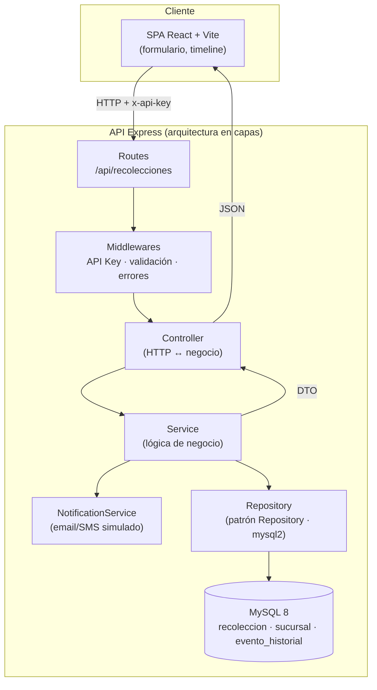

# Arquitectura

## Visión general

## Responsabilidad por capa

| Capa            | Responsabilidad                                                        | Archivos |
| --------------- | ---------------------------------------------------------------------- | -------- |
| **Routes**      | Definir endpoints y aplicar middleware de seguridad.                   | `routes/` |
| **Middlewares** | API Key (`x-api-key`), 404 de rutas, manejo central de errores.        | `middlewares/` |
| **Controller**  | Adaptar la petición/respuesta HTTP; no contiene reglas de negocio.     | `controllers/` |
| **Validator**   | Validar y normalizar la entrada del cliente.                           | `validators/` |
| **Service**     | Reglas de negocio: 404/400, asignación de sucursal, historial, notif.  | `services/` |
| **Repository**  | Persistencia en MySQL aislada tras una interfaz (motor intercambiable).| `repositories/` |
| **Utils/Config**| `AppError`, `asyncHandler`, generador de código, constantes, env.      | `utils/`, `config/` |

## Principios aplicados

- **Separación de responsabilidades (SoC)** y **Single Responsibility**.
- **Inversión/inyección de dependencias**: el `Service` recibe el repositorio y
  el notificador por constructor → facilita pruebas y sustitución.
- **Repository Pattern**: desacopla la lógica de negocio del motor de datos.
- **Error handling centralizado**: una sola fuente de verdad para las respuestas
  de error, con distinción entre errores operacionales y no controlados.
