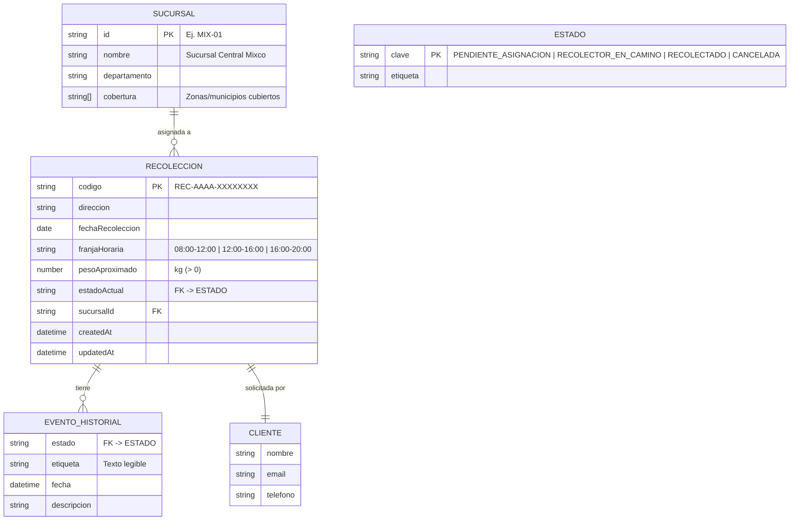

# Estructura de datos

El almacenamiento se simula con archivos **JSON** (`backend/src/data/`), pero el
modelo está diseñado para trasladarse directamente a una base de datos
relacional (MySQL/SQL Server) gracias al patrón Repository.

## Diagrama Entidad–Relación



> En la implementación con JSON, `CLIENTE` y `EVENTO_HISTORIAL` se almacenan
> embebidos dentro de cada documento `RECOLECCION` (modelo orientado a documento).
> En un modelo relacional serían tablas independientes relacionadas por
> `codigo` / `sucursalId`.

## Modelo relacional equivalente (referencia SQL)

```sql
CREATE TABLE sucursal (
  id           VARCHAR(10)  PRIMARY KEY,
  nombre       VARCHAR(120) NOT NULL,
  departamento VARCHAR(80)
);

CREATE TABLE recoleccion (
  codigo            VARCHAR(24)  PRIMARY KEY,
  direccion         VARCHAR(255) NOT NULL,
  fecha_recoleccion DATE         NOT NULL,
  franja_horaria    VARCHAR(20)  NOT NULL,
  peso_aproximado   DECIMAL(6,2) NOT NULL CHECK (peso_aproximado > 0),
  estado_actual     VARCHAR(30)  NOT NULL,
  sucursal_id       VARCHAR(10)  REFERENCES sucursal(id),
  cliente_nombre    VARCHAR(120),
  cliente_email     VARCHAR(120),
  cliente_telefono  VARCHAR(30),
  created_at        DATETIME     NOT NULL,
  updated_at        DATETIME     NOT NULL
);

CREATE TABLE evento_historial (
  id               BIGINT AUTO_INCREMENT PRIMARY KEY,
  recoleccion_codigo VARCHAR(24) REFERENCES recoleccion(codigo),
  estado           VARCHAR(30)  NOT NULL,
  fecha            DATETIME     NOT NULL,
  descripcion      VARCHAR(255)
);
```

## Catálogo de estados

| Clave                    | Etiqueta                 | ¿En la línea de tiempo? |
| ------------------------ | ------------------------ | ----------------------- |
| `PENDIENTE_ASIGNACION`   | Pendiente de Asignación  | Sí (paso 1)             |
| `RECOLECTOR_EN_CAMINO`   | Recolector en Camino     | Sí (paso 2)             |
| `RECOLECTADO`            | Recolectado              | Sí (paso 3)             |
| `CANCELADA`              | Cancelada                | No (estado terminal)    |
