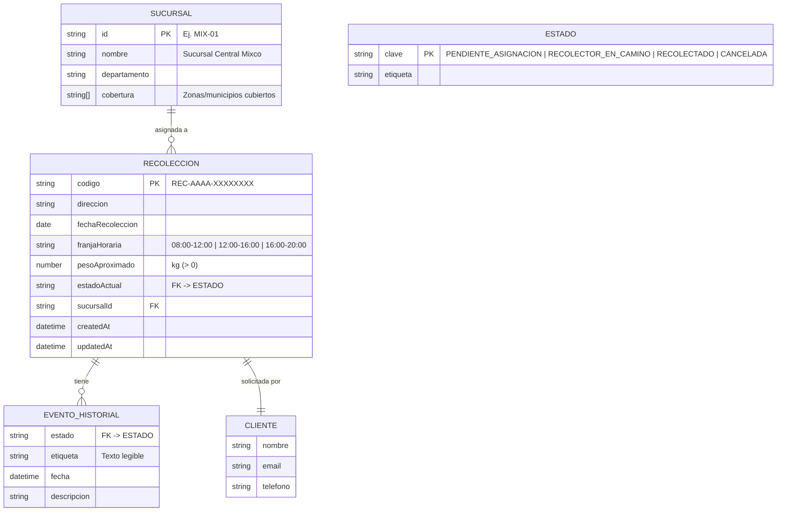

# Estructura de datos

El almacenamiento usa **MySQL 8**. El esquema y los datos de prueba están en
`db/init/` (`01-schema.sql` y `02-seed.sql`), que se ejecutan automáticamente al
inicializar el contenedor de MySQL o con `npm run db:setup` en local. El acceso
está aislado tras el patrón Repository (`backend/src/repositories/`).

## Diagrama Entidad–Relación



> Los datos del `CLIENTE` se guardan como columnas dentro de `recoleccion`
> (`cliente_nombre`, `cliente_email`, `cliente_telefono`), mientras que
> `EVENTO_HISTORIAL` es una tabla independiente relacionada por
> `recoleccion_codigo`. La `cobertura` de cada sucursal se almacena como columna
> `JSON`.

## Esquema SQL (implementación real)

> Fuente autoritativa: [`db/init/01-schema.sql`](../db/init/01-schema.sql) y
> [`db/init/02-seed.sql`](../db/init/02-seed.sql).

```sql
CREATE TABLE sucursal (
  id           VARCHAR(10)  PRIMARY KEY,
  nombre       VARCHAR(120) NOT NULL,
  departamento VARCHAR(80),
  cobertura    JSON
);

CREATE TABLE recoleccion (
  codigo            VARCHAR(24)  PRIMARY KEY,
  direccion         VARCHAR(255) NOT NULL,
  fecha_recoleccion DATE         NOT NULL,
  franja_horaria    VARCHAR(20)  NOT NULL,
  peso_aproximado   DECIMAL(6,2) NOT NULL CHECK (peso_aproximado > 0),
  estado_actual     VARCHAR(30)  NOT NULL,
  sucursal_id       VARCHAR(10)  REFERENCES sucursal(id),
  cliente_nombre    VARCHAR(120),
  cliente_email     VARCHAR(120),
  cliente_telefono  VARCHAR(30),
  created_at        DATETIME     NOT NULL,
  updated_at        DATETIME     NOT NULL
);

CREATE TABLE evento_historial (
  id               BIGINT AUTO_INCREMENT PRIMARY KEY,
  recoleccion_codigo VARCHAR(24) REFERENCES recoleccion(codigo),
  estado           VARCHAR(30)  NOT NULL,
  fecha            DATETIME     NOT NULL,
  descripcion      VARCHAR(255)
);
```

## Catálogo de estados

| Clave                    | Etiqueta                 | ¿En la línea de tiempo? |
| ------------------------ | ------------------------ | ----------------------- |
| `PENDIENTE_ASIGNACION`   | Pendiente de Asignación  | Sí (paso 1)             |
| `RECOLECTOR_EN_CAMINO`   | Recolector en Camino     | Sí (paso 2)             |
| `RECOLECTADO`            | Recolectado              | Sí (paso 3)             |
| `CANCELADA`              | Cancelada                | No (estado terminal)    |
